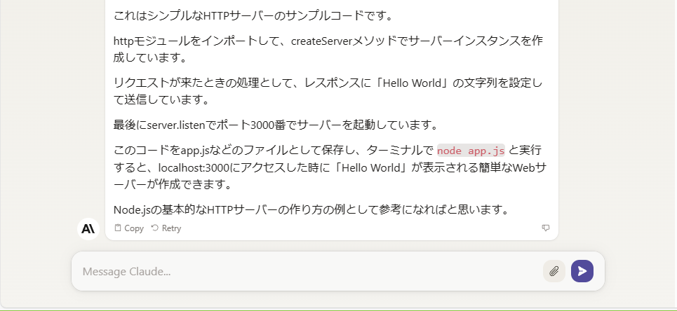

<!--
    title: claude.aiつかってみた
    tags:  claude
-->

## 初投稿

Qiita初投稿になります。
皆様、よろしくお願いいたします。

## 概要

X(旧Twitter)でChatGPTに似た「claude.ai」という情報をキャッチした。

そのサイトは以下になる。
https://claude.ai/

## 使い方(ログイン)

まずはお試し。

サインアップする方はサインアップ。
サインアップ済みの人はサインインしてください。

## 使い方(サンプル)

ChatGPTで質問するように投げかけてみる。

## 使い方(サンプル)

サンプルコードを作成してみる。

## まとめ

今回は無料版のみ軽くお試ししてみた。
こちらでも使えそうな予感が。

今後は有料版や他の機能もある為、これからどんどん触っていく。

---

最後までお読みいただきありがとうございました！