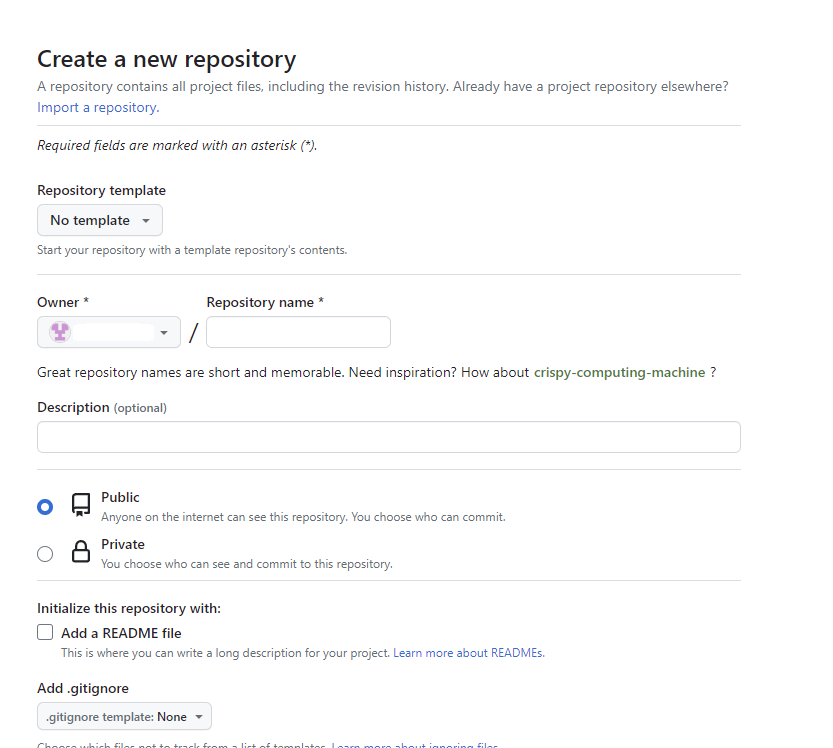
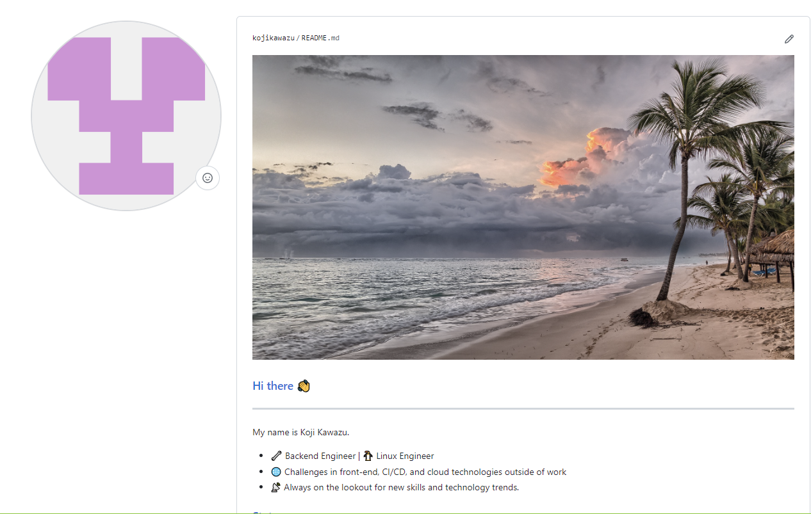
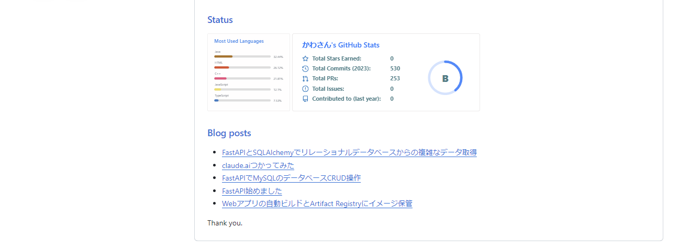

<!--
    title: GitHubプロフィールのカスタマイズ方法
    tags:  GitHub, Git
-->

## はじめに

最近、GitHubのアカウントページをカスタマイズしていた際に、プロフィールを表示する機能を知りました。調べてみたところ、さくっとできそうな作業ボリュームでしたので実施しました。この記事は試した内容を残します。

## プロフィール用のGitHubリポジトリ作成

まずはプロフィール用のGitHubリポジトリを作成します。
そのリポジトリによりプロフィール管理が可能になります。

リポジトリを作成する際、「Repository name*」欄には自分のGitHubアカウント名を入力してください。
そうするとプロフィール用と自動認識されます。



## README.mdを編集する

このREADME.mdは、GitHubアカウントのプロフィール画面としての内容を定義します。
markdown記法で記載可能です。

- タイトル画像
- 概要
- Status(ウィジェットを使う)
- blog(QiitaやZennの記事のURLをリスト表示する)

## タイトル

```markdown

```

## Status(ガジェット)

このステップを実行すると、指定したフィードリストからブログの投稿を自動的に取得し、それをREADMEに追加します。

ここを参考に使わせていただきました。
https://github.com/anuraghazra/github-readme-stats


サンプルコードは以下になります。
```html
<div style="display: flex;">
  
  
</div>
```

私のGitHubアカウントで表示すると以下になります。
これだけでも一目で把握できて便利ですね。
<div style="display: flex;">
  
  
</div>

## blog(QiitaやZennの記事のURLをリスト表示する)

まずはREADME.mdに以下内容を記載します。
workflowにより、このSTARTとENDの間に記事のURLが追加されるイメージです。
```markdown
<!-- BLOG-POST-LIST:START -->
<!-- BLOG-POST-LIST:END -->
```

次に .github/workflows/blog-sync.yml を作成します。
ymlファイルの内容は以下になります。

```yml
name: Latest blog post workflow
on:
  schedule:
    - cron: '0 * * * *'
  workflow_dispatch:
permissions:
  contents: write

jobs:
  update-readme-with-blog:
    name: Update this repo's README with latest blog posts
    runs-on: ubuntu-latest
    steps:
      - name: Checkout
        uses: actions/checkout@v3
      - name: Pull in dev.to posts
        uses: gautamkrishnar/blog-post-workflow@v1
        with:
          feed_list: "https://zenn.dev/kou_kawa/feed,https://qiita.com/kawasan/feed/"
```

今回は毎時0分にワークフローを実行するように設定しています。
リポジトリのコンテンツに対して書き込み操作を行うため、書き込み権限を設定しています。

```yml
- name: Pull in dev.to posts
  uses: gautamkrishnar/blog-post-workflow@v1
  with:
    feed_list: "https://zenn.dev/kou_kawa/feed,https://qiita.com/kawasan/feed/"
```

このステップでは、指定したフィードリストからブログの投稿を取得し、それをREADMEに自動で追加します。「feed_list」に追加したい記事アカウントURLを追加するとそれぞれの記事サイトに投稿している記事のURLがREADME.mdに追加されます。

```markdown
<!-- BLOG-POST-LIST:START -->
- [claude.aiつかってみた](https://qiita.com/kawasan/items/8d61322c3fc35bf9928e)
<!-- BLOG-POST-LIST:END -->
```

ワークフローを設定すると、毎時0分に自動で実行され、新しい記事のURLがREADMEに追加されます。
上記は追加された記事リスト(抜粋)です。

## pushしてプロフィールに反映する

ローカルリポジトリでプッシュし、リモートリポジトリのデフォルトブランチにマージし終えるとGitHubのプロフィール画面に反映されます。

私のGitHubのプロフィール欄をサンプルとして表示してます。



## 参考URL

こちらの記事を参考にしました。

- つよつよGitHubプロフィールの作り方
https://qiita.com/moroi/items/6847e4ea5defc8baded4

- 3分できる即席GitHubプロフィール
https://zenn.dev/t_keshi/articles/instant-github-profile

## 終わりに

GitHubアカウントページのカスタマイズ方法について記事にまとめてみました。いつものGitHubリポジトリを作成し、READEME.mdを書くことでさくっとプロフィール画面を作れるのはありがたいと思いました。今後もウィジェットを探しながら、良いプロフィールを模索したいと思います。

最後までお読みいただきありがとうございました！